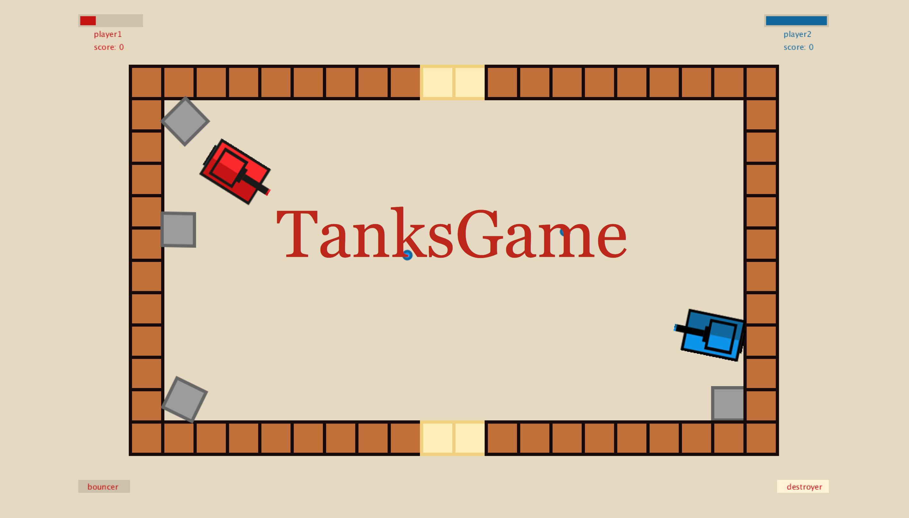

# ID311 Final Project
## The Tanks Game

### Personal Information

* Name: Ayan Mukanov
* Student id: 20170881
* Email: mukanov.ayan@kaist.ac.kr

### Table of content
* [JavaCode](Java_Code)
* [JavaScriptCode](Javascript_Code)
* [JavaScriptAppLink](https://mukanov8.bitbucket.io/index.html)
* [DemoVideo](Video/TanksGame_Demo.mp4) 
* [DemoYoutubeLink](https://www.youtube.com/watch?v=OhLAHI2fBtg&feature=youtu.be)
* Description
* How to play
* Dependencies
* Contributions and sources
	
### Description of the project
This is a 2-player Tanks game inspired by retro tanks game but with a new, modern look.  
The two players, red and blue tanks respectively, need to battle against each other, and the first player to have 5 kills(5 won matches) wins the game. The players can move their tanks freely across the gameboard and try to destroy each other's tanks.

Players can play the game in Java Desktop app., while they can use JavaScript Web client to create a new maps or select the tanks to play with. 

Some objectives and features of the game:
- 2 Players play and compete with each other.
- Player need to destroy opposite player's tank 5 times to win the game.
- Each player has select among 3 types of different tanks in JS web client app. Each tank has different characteristics (total health amount, speed, etc).
- Accurate physics of & between objects(tanks, bullets, bricks, environment) due to use of [Fisica](http://www.ricardmarxer.com/fisica/) library.
- Each player can shoot only 1 bullet per second and at most 4 bullets at any given time.
- Each player can select among two types of weaponry (Bouncer and Destroyer) and each reacts differently upon contact with surface/enemy and have different damage.
- In the main menu, player can choose the map to play on.
- Players can create their own custom map in JS web client app.
- Players can choose among 3 types of bricks - solid, moveable, and soft(destroyable).

Architecture and class diagram:

There are 5 .pde files for each class in the JavaCode directory:

- [Java_Code](Java_Code/Java_Code.pde) is the main part of the program that handles everything in the game.
- [MenuPages](Java_Code/MenuPages.pde) class handles displaying all necessary information (i.e. menus) on the display, such as starting page, map-choosing page, tank-putting page, game-over pages, necessary buttons as well as each player's health bar.
- [Player](Java_Code/Player.pde) class handles creation of players (i.e. tanks) by instantiating an object of class [FBox](http://www.ricardmarxer.com/fisica/reference/fisica/FBox.html).
- [Weapon](Java_Code/Weapon.pde) class handles creation of weapon (i.e. bullets) each time a player fires by creating and setting an object of class [FCircle](http://www.ricardmarxer.com/fisica/reference/fisica/FCircle.html)
- [ExplosionAnimation](Java_Code/ExplosionAnimation.pde) class handles drawing the animation of explosion when bullet hits the tank or bricks.

The JavaScript Client app. uses are 3 html pages for map creation, tank selection, and waiting for game command.
- [StartingPage](https://mukanov8.bitbucket.io/index.html)
- [MapCreationPage](https://mukanov8.bitbucket.io/map.html)
- [TanksSelectionPage](https://mukanov8.bitbucket.io/tanks.html)

Java:
- Developed in [Processing](https://processing.org/).
- The game is heavily based on usage of [Fisica](http://www.ricardmarxer.com/fisica/) library, as most of the objects created are instances of fisica's FBody class. The physics of the game (and collision detection) is also attributed to functionalities of this library.
- The Processing Sound library was used to be able to play different game sounds (shooting sound, explosion, collision, button click).

JavaScript:
- Developed in [p5.js](https://p5js.org/)
- Used built-in functionalities of p5.js.

WebSockets is being used for communication between main Java (server) game applicaiton and JavaScript web (client) editor.

### How to play

Types of tanks: 

Choose a map or create your own. The last custom created map will be saved under the label of "Map#3". 
Select the tanks and start the game.

Play the game until someone loses 5 times.

### Dependencies
Libraries used:
- [Processing](https://processing.org/).
- [p5.js](https://p5js.org/).
- [Fisica](http://www.ricardmarxer.com/fisica/) library for Processing.
- Processing [Sound](https://processing.org/reference/libraries/sound/index.html) library.
- [Java.util](https://docs.oracle.com/javase/8/docs/api/java/util/package-summary.html) package.
- WebSockets.

### Contributions and sources

- Created by [Ayan Mukanov](https://github.com/mukanov8)
- Sounds used in a game by [Freesounds](https:/www.freesoundslibrary.com/)
- The tanks movement (keyboard presses) handling was inspired by [TankWars](https://github.com/dhack8/TankWars)
- The [MenuPages class](Project1_Code/MenuPages.pde) 
organisation was inspired by that of [BubbleTanks](https://github.com/JasonLin43212/Bubble-Tanks-Final-Project)

